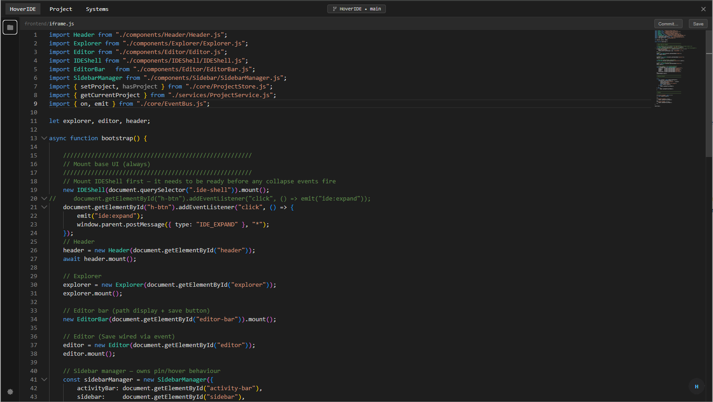
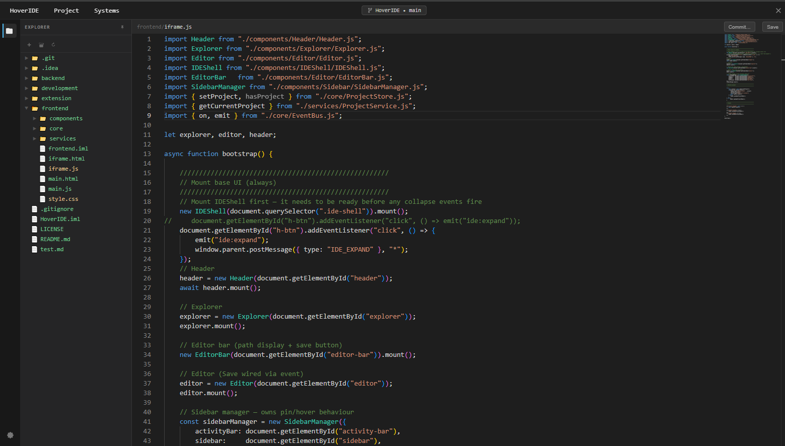
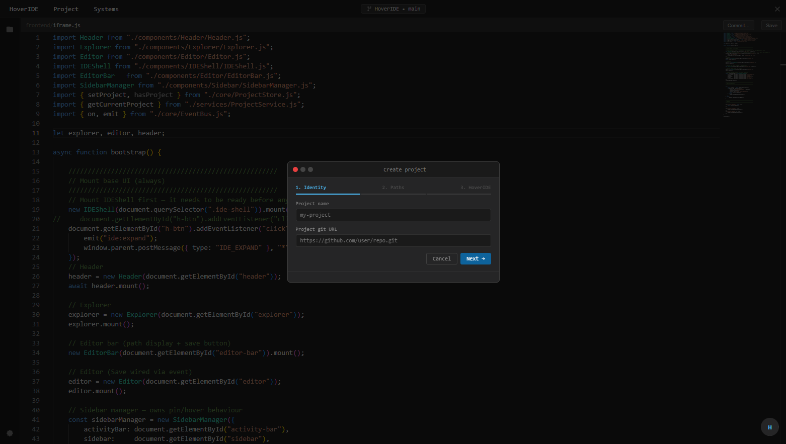
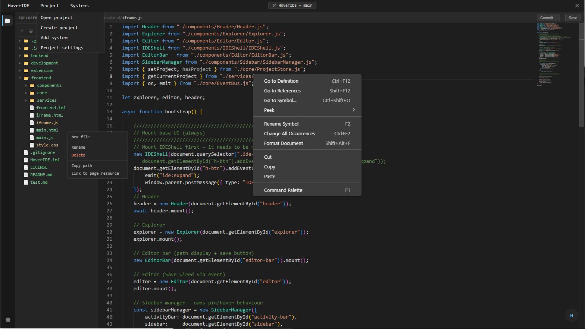

# 🚀 HoverIDE

> The next-generation **Overlay IDE** for full-stack, runtime-aware development
---

## ✨ What is HoverIDE?

HoverIDE is a **browser-based IDE overlay** that sits on top of your running application and allows you to:

* 🧠 Understand your system in real-time
* ⚡ Edit code directly in context
* 🔗 Connect frontend, bacdkend, and runtime behavior
* 🛠 Automate workflows with scripts

Unlike traditional IDEs, HoverIDE doesn't just edit code — it **understands your application while it's running**.

---

## 🧩 Core Concepts

### 🖥 Overlay IDE

HoverIDE runs *on top of your application* (e.g. `localhost:8000`) and provides:

* File explorer
* Code editor (Monaco)
* Git integration
* Project management
* System visualization

---

### 🔌 Systems

A **System** represents a part of your application:

* Frontend (Vanilla ES6, React, etc.)
* Backend (Node.js, APIs)
* Browser Extension

Systems are **models**, not implementations.

---

### 🔧 System Adapters

Adapters are the runtime layer:

* Extract metadata (routes, components, files)
* Observe runtime behavior
* Emit events

---

### ⚡ HoverScript

HoverScript is the automation layer of HoverIDE.

It allows you to:

* React to events (e.g. API calls)
* Automate tasks (generate components, refactor code)
* Extend IDE behavior

Example:

```js
export default {
  onEvent(event, ctx) {
    if (event.type === "api.request") {
      console.log("API called:", event.payload.url)
    }
  }
}
```

---

## 🏗 Architecture Overview

```
Overlay IDE (Frontend)
        ↓
HoverIDE Core (Backend)
        ↓
Systems (Models)
        ↓
System Adapters (Runtime)
        ↓
Real Applications (Node, Browser, etc.)
```

---

## 🛠 Features

### ✍️ Code Editing

* Monaco editor integration
* Auto-save with debounce
* Language detection

### 📂 File Explorer

* Tree-based navigation
* Inline file/folder creation
* Git status coloring

### 🔄 Git Integration

* Commit directly from IDE
* Branch management

### 🌐 Live DOM Integration

* Edit HTML directly from the browser
* Sync DOM ↔ Editor

### 🧪 Sandbox Environment

* Safe development environment
* Branch-based experimentation
* Runtime restart loop

### 🔁 Self-Hosting IDE

* HoverIDE can be developed **inside itself** 🤯

---

## 📸 Screenshots

### 🖼 Main Overlay Interface


> The little "H" button on the bottom right opens the overlying IDE
---

### 🖼 File Explorer & Git Status


> File tree with colored files indicating git changes

---

### 🖼 Editor + Live HTML Sync


> Project creation window

---

### 🖼 Context menu


> Modern IDE features 

---

## 🚀 Getting Started

### 1. Install dependencies

```bash
cd backend
npm install
```

---

### 2. Start the server

```bash
node server.js
```

---

### 3. Load the extension

* Go to `chrome://extensions`
* Enable Developer Mode
* Load `/extension` folder

the extension should appear in your browser header bar
You can now inject the IDE on top of whatever page you want from the popup window of the extension.


### 4. Open HoverIDE in auto-edit mode (optional) 

Open this page in the browser
```
http://localhost:3000/main.html
```

Inject the IDE.


---

## 📁 Project Structure

```
/backend        → API, services, systems
/frontend       → Overlay IDE UI
/extension      → Browser extension
```

---

## 🧪 Development Philosophy

HoverIDE is built with the idea that:

> "The best way to build an IDE is to use the IDE to build itself"

This means:

* 🔁 Self-hosted development
* ⚡ Rapid iteration
* 🧠 Deep system understanding

---

## ⚠️ Important Notes

* ⚡ This is a **power tool for expert developers**
* 💣 It can modify your filesystem quickly
* 🔒 Always use in **sandbox environments**
* 🚫 Not intended for production attachment

---

## 📌 Roadmap / TODO

### 🧩 Systems & Runtime

* [ ] Implement System Adapters
* [ ] Build System Runtime Service
* [ ] Standardize event model

### ⚡ HoverScript

* [ ] Script engine (sandboxed execution)
* [ ] Event subscriptions
* [ ] Script permissions system

### 🧠 Intelligence Layer

* [ ] Full-stack tracing (UI → API → backend)
* [ ] Smart refactoring tools

### 🛠 IDE Improvements

* [ ] Event inspector panel
* [ ] Script debugger
* [ ] Better UI/UX

### 🌐 Integration

* [ ] Support for React/Vue systems
* [ ] External API tracking

### 🤝 Collaboration

* [ ] Shared script repository
* [ ] Multi-user support

---

## 💡 Vision

HoverIDE aims to become:

> A unified development environment where code, runtime, and logic converge into a single interactive layer.

---

## ❤️ Contributing

Contributions are welcome!

* Open issues
* Suggest features
* Improve systems/adapters

---

## 🧠 Final Thought

> Traditional IDEs edit code.
> HoverIDE understands systems.

---

🔥 *Build faster. Think deeper. Stay in context.*
